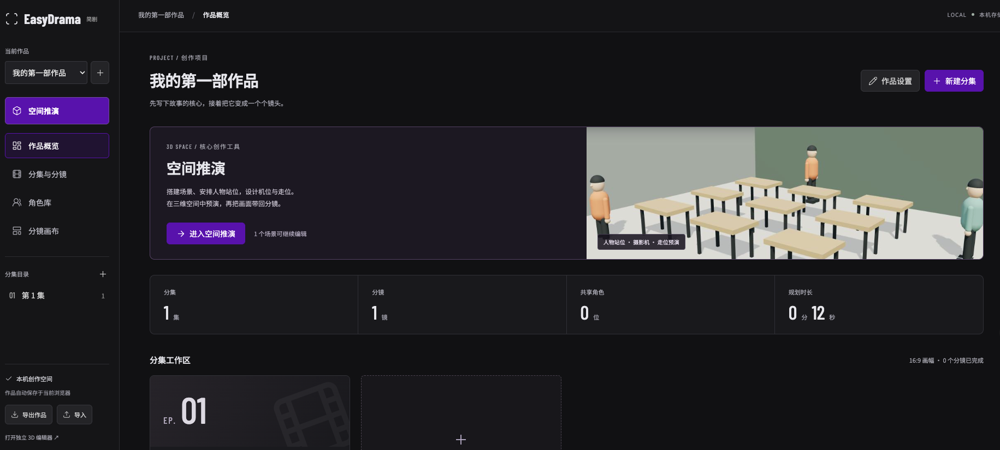
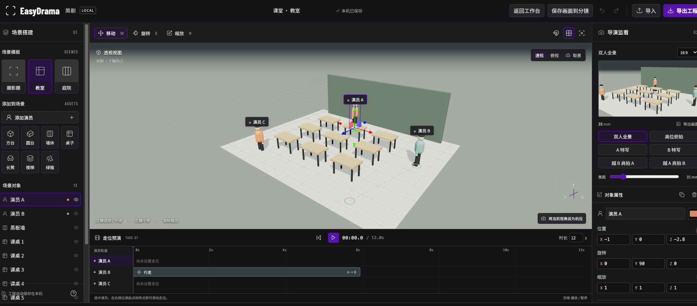

# EasyDrama 简剧 · 短剧创作工作台

本地运行的短剧创作工作台，将作品、分集、共享角色、分镜画布和 3D 空间推演连接起来。使用 Vite + Three.js + 原生 JavaScript，无需账号或 API Key。

## 界面展示

作品概览：集中管理分集与角色，从首页进入空间推演。



3D 空间推演：搭建场景、安排人物站位，调整摄影机与走位时间轴。



## 本地启动

需要 Node.js 22 或更高版本。

```sh
npm install
npm run dev
```

打开终端打印的地址。生产构建：`npm run build`；预览构建：`npm run preview`；数据层测试：`npm test`。

## 创作工作台

首页为作品工作台；`/?editor=1` 可以直接打开原有独立 3D 编辑器。

- 作品：创建、切换、编辑名称 / 梗概 / 画幅、删除、导入导出整个作品。
- 分集：创建、编辑、删除；每集有独立剧本和有序分镜列表，剧本显式保存并提醒未保存的离开操作。
- 角色库：维护名称、定位、设定、色标和参考图，在各集分镜中复用；删除时清理关联。
- 分镜：名称、场次 / 地点、描述、时长、景别、制作状态、角色关联和参考图；支持复制、排序和删除。
- 画布：拖动卡片标题排布；空白拖动平移；滚轮或按钮缩放；整理布局与适应画布。聚焦卡片标题时可用方向键微调位置。
- 空间推演：每个分镜独立保存 3D 场景；首次进入时从关联角色初始化演员。已有场景不会因角色库修改而自动覆盖。保存机位截图到分镜后，画布立即可用；返回工作台前检查保存结果。
- 本地存储：旧独立场景首次复制为第一部作品的首个分镜，原存储键保留。图片自动压缩；导入作为独立副本添加，不覆盖同名作品。

推荐流程：新建作品 → 创建角色 → 新建分集、编写剧本 → 添加分镜并关联角色 → 画布排布 → 空间推演 → 保存画面到分镜 → 导出作品备份。

## 3D 编辑器已实现

- 摄影棚、教室、庭院模板。
- 添加演员、方台、圆台、墙体、桌子、长凳、楼梯和绿植。
- 三维拾取、对象列表选择、隐藏、复制、删除。
- 移动、旋转、缩放手柄，精确数值编辑，0.5 米 / 15 度吸附。
- 双人全景、高位俯拍、A/B 特写、双向过肩机位。
- 摄影机焦距、16:9 / 9:16 / 1:1 / 2.35:1 画幅、独立导演监看。
- 当前编辑视角转为摄影机，以及最终取景的高清 PNG 导出。
- 演员 A→B 直线走位、空间路径显示、开始与结束时间、时间轴播放和回拖。
- 60 步撤销重做、本机自动保存、JSON 工程导入导出。
- 基础光照方向与强度、地面网格。

## 操作

左键点击选中，左键拖动环绕，右键拖动平移，滚轮缩放。拖动选中对象的彩色坐标轴进行变换。

| 快捷键             | 操作                |
| ------------------ | ------------------- |
| W / E / R          | 移动 / 旋转 / 缩放  |
| F / G              | 聚焦选中 / 切换网格 |
| Ctrl 或 ⌘ Z        | 撤销                |
| Ctrl 或 ⌘ Shift Z  | 重做                |
| Ctrl 或 ⌘ D        | 复制                |
| Ctrl 或 ⌘ S        | 保存到本机          |
| Delete / Backspace | 删除选中对象        |
| 空格               | 播放 / 暂停         |
| Esc                | 返回编辑 / 取消选择 |

设置走位：选择演员 → 记录起点 → 用手柄或位置输入移动演员 → 设为终点 → 播放。完成设置后人物恢复到起点，路径显示为虚线。返回编辑会恢复原始坐标，不会将预演位置写回工程。

## 范围和限制

- 本版完成本地创作骨架与三维预演，不包含 AI 剧本拆解、AI 生图 / 视频生成、视频编码、多机位切镜、云同步或多人协作。
- 人物为程序化简化模型，走路为基础步态，不含碰撞避让、脚部 IK 或上下楼梯适配。
- 数据保存在当前浏览器 localStorage；图片较多时可能触及浏览器配额。失败会显示提示并保留表单输入；切换浏览器或清除站点数据前，请导出 `.frame-work.json` 作品备份。独立三维工程使用 `.frame.json`。
- 作品导入限制 30 MB，图片上传限制 20 MB（仅 PNG / JPEG / WebP），压缩后每张至多约 800 KB 文本；实际可保存总量受浏览器配额限制。
- 分镜规划时长允许 1–600 秒；3D 预演仍为 1–120 秒，两者单独维护。角色库只在第一次创建场景时初始化演员，后续空间编辑不被角色设定更新覆盖。
- 导入限制为 2 MB / 200 个对象，完整验证通过后才替换当前工程；导入和模板切换均可撤销。
- 三维渲染需要 WebGL 2 和浏览器硬件加速。窄屏采用上下分区；精确编辑推荐桌面浏览器。
- Google Fonts 不可用时回退到系统中文字体，核心功能不依赖字体网络请求。

## 代码结构

- `src/entry.js`：按页面职责延迟加载工作台或三维编辑器。
- `src/workspace.js`：作品 / 分集 / 分镜 / 角色结构、导入校验、持久化和旧存档迁移。
- `src/workbench.js`、`src/workbench.css`：工作台视图、实体表单、分镜列表和自由画布。
- `src/editor-context.js`：三维场景与当前分镜的数据桥接。
- `src/media.js`：本地图片解码与压缩。
- `tests/workspace.test.js`：迁移、引用清理、数据隔离、损坏导入、排序和存储失败验证。

- `src/project.js`：工程格式、模板、验证、历史和走位采样。
- `src/stage.js`：几何模型、渲染、手柄、机位和动画。
- `src/main.js`：界面、交互、保存和文件处理。
- `src/style.css`：中文编辑器布局与响应式样式。
- `tests/project.test.js`：数据往返、无效输入、播放不变性和历史隔离。

当前坐标约定为米制、Y 轴向上，人物正面为 +Z。
